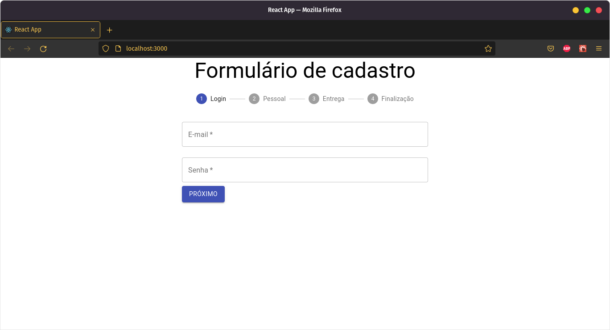

<h1> Formulário React<h1>

 
 
  <h2>Technologies</h2>
  <ul>
  <li> ReactJs</li>
  <li>Material UI</li>
  <li>JavaScript</li>
  </ul>

<h2>About this project</h2>

React Form, created during Aluras's ReactJS Formation. This application was developed to practice function react components and data validation, as well as implement Material UI.

